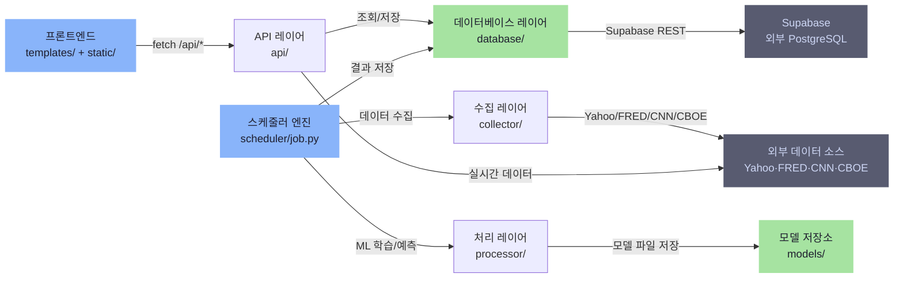

# Passive Financial Data Analysis

AI 기반 미국 ETF 패시브 투자 분석 플랫폼

> HMM 시장 국면 분석, XGBoost 폭락/급등 전조 탐지, 5모델 앙상블 가격 예측으로 ETF 투자 전략을 제공합니다.

**배포**: https://passive-financial-data-analysis-production.up.railway.app

---

## 목차

1. [시스템 아키텍처](#시스템-아키텍처)
2. [디렉토리 구조](#디렉토리-구조)
3. [핵심 레이어](#핵심-레이어)
   - [API 레이어](#1-api-레이어-api)
   - [수집 레이어](#2-수집-레이어-collector)
   - [처리 레이어 (ML)](#3-처리-레이어-processor)
   - [데이터베이스 레이어](#4-데이터베이스-레이어-database)
   - [스케줄러](#5-스케줄러-schedulerjobpy)
   - [프론트엔드](#6-프론트엔드-templates--static)
4. [데이터 파이프라인](#데이터-파이프라인)
5. [ML 모델 상세](#ml-모델-상세)
6. [DB 스키마](#db-스키마)
7. [외부 데이터 소스](#외부-데이터-소스)
8. [배포 구성](#배포-구성)
9. [환경 변수](#환경-변수)

---

## 시스템 아키텍처



---

## 디렉토리 구조

```
Passive-Financial-Data-Analysis-main/
├── api/                            # REST API 레이어
│   ├── app.py                      #   FastAPI 앱 + 스케줄러 초기화 + 라우터 등록
│   └── routers/                    #   API 엔드포인트 모듈
│       ├── regime.py               #     Noise vs Signal HMM 국면 API
│       ├── macro.py                #     거시 지표 + RSI + Fear & Greed API
│       ├── index_feed.py           #     ETF 가격 데이터 API
│       ├── sector_cycle.py         #     섹터 경기국면 HMM API
│       ├── crash_surge.py          #     폭락/급등 전조 XGBoost API
│       ├── market_summary.py       #     일일 시장 요약 + AI 해설 (Groq LLM)
│       ├── chart.py                #     차트 OHLC + 30일 예측 API
│       └── tracking.py             #     사용자 방문 추적 API
├── collector/                      # 데이터 수집 레이어
│   ├── market_data.py              #   S&P500, VIX, 금리, RSI 등 매크로 수집
│   ├── noise_regime_data.py        #   HMM 학습용 8개 월간 피처 수집
│   ├── crash_surge_data.py         #   XGBoost 학습용 44개 일간 피처 수집
│   ├── index_price.py              #   31개 ETF 가격/등락률 수집
│   ├── fear_greed.py               #   CNN 공포탐욕지수 + CBOE Put/Call 비율
│   ├── sector_macro.py             #   섹터 거시 지표 (PMI, 금리, ANFCI 등)
│   └── sector_etf.py               #   11개 섹터 ETF 수익률 수집
├── processor/                      # ML 모델 학습/예측 레이어
│   ├── feature1_regime.py          #   GaussianHMM 4-state Noise 국면 분류
│   ├── feature2_sector_cycle.py    #   GaussianHMM 4-state 경기국면 분류
│   ├── feature3_crash_surge.py     #   XGBoost 3-class 폭락/급등 탐지
│   └── feature4_chart_predict.py   #   5모델 앙상블 + GARCH 30일 가격 예측
├── database/                       # 데이터베이스 접근 레이어
│   ├── supabase_client.py          #   Supabase 연결 싱글톤
│   └── repositories.py             #   전 테이블 CRUD 함수 (upsert/fetch)
├── scheduler/                      # 백그라운드 작업 오케스트레이션
│   └── job.py                      #   경량(10분)/전체(3시간) 파이프라인 관리
├── models/                         # 학습된 ML 모델 저장소
│   ├── noise_hmm.pkl               #   HMM Noise 모델
│   ├── crash_surge_xgb.pkl         #   XGBoost 폭락/급등 모델
│   └── fred_cache.pkl              #   FRED 데이터 캐시
├── static/                         # 프론트엔드 정적 파일
│   ├── css/main.css                #   반응형 CSS (다크/라이트 테마)
│   └── js/
│       ├── main.js                 #   대시보드 핵심 UI (2095줄)
│       ├── chart.js                #   TradingView 차트 (960줄)
│       ├── i18n.js                 #   다국어 지원 한/영 (1013줄)
│       └── sector.js               #   섹터 분석 UI (374줄)
├── templates/                      # 서버 렌더링 HTML
│   ├── index.html                  #   메인 대시보드
│   └── stats.html                  #   사용자 통계 페이지
├── supabase_tables.sql             # DB 스키마 DDL
├── Dockerfile                      # Docker 빌드 설정
├── railway.json                    # Railway 배포 설정
├── requirements.txt                # Python 의존성
├── CLAUDE.md                       # 개발 가이드라인
└── update.py                       # 변경 이력 보관 파일
```

---

## 핵심 레이어

### 1. API 레이어 (`api/`)

FastAPI 기반 REST API. `api/app.py`에서 앱 생성, 라우터 등록, 스케줄러 초기화를 담당합니다.

**미들웨어 & 설정**
- CORS: 전체 허용 (React Native WebView 호환)
- 정적 파일: `/static` 경로 마운트
- 템플릿: Jinja2 (`/templates`)
- 라이프사이클: `lifespan` 컨텍스트에서 APScheduler 시작/종료

**라우터 & 엔드포인트**

| 라우터 | 경로 접두사 | 주요 엔드포인트 | 설명 |
|--------|-------------|----------------|------|
| `regime.py` | `/api/regime` | `/current`, `/history`, `/score-distribution` | Noise vs Signal HMM 국면 |
| `macro.py` | `/api/macro` | `/latest`, `/fear-greed` | 거시 지표 + 공포탐욕지수 |
| `index_feed.py` | `/api/index` | `/latest`, `/debug` | 31개 ETF 가격 |
| `sector_cycle.py` | `/api/sector-cycle` | `/current`, `/holdings-perf`, `/history` | 섹터 경기국면 |
| `crash_surge.py` | `/api/crash-surge` | `/current`, `/history`, `/direction`, `/refresh` | 폭락/급등 전조 |
| `market_summary.py` | `/api/market-summary` | `/today`, `/ai-insight` | 시장 요약 + Groq AI 해설 |
| `chart.py` | `/api/chart` | `/ohlc?ticker=SPY&interval=1d`, `/predict?ticker=SPY` | 차트 데이터 + 30일 예측 |
| `tracking.py` | `/api/tracking` | `/visit` | 사용자 방문 기록 |

**헬스 체크**
- `GET /api/health` — 스케줄러 상태 + 모델 파일 존재 여부
- `GET /api/health/diagnose` — 파이프라인 단계별 유효성 검증

---

### 2. 수집 레이어 (`collector/`)

5개 외부 소스에서 원시 데이터를 수집하고 기초 피처를 계산합니다.

| 모듈 | 수집 대상 | 피처 수 | 주기 |
|------|----------|---------|------|
| `market_data.py` | S&P500, VIX, 금리, RSI 등 | 매크로 지표 | 경량 10분 |
| `noise_regime_data.py` | Shiller CAPE, FRED, 섹터주 25종, Amihud 5종 | 8개 월간 | 전체 3시간 |
| `crash_surge_data.py` | SPY OHLCV, FRED 8개, Yahoo 4개, Cboe 5개 | 44개 일간 | 전체 3시간 |
| `index_price.py` | 31개 ETF 가격/등락률 | - | 경량 10분 |
| `fear_greed.py` | CNN 공포탐욕지수, CBOE Put/Call 비율 | - | 경량 10분 |
| `sector_macro.py` | PMI, 금리 스프레드, ANFCI, 실업수당 등 | 10개 | 전체 3시간 |
| `sector_etf.py` | 11개 섹터 ETF 수익률 | - | 전체 3시간 |

**`crash_surge_data.py` 피처 분류 (44개)**

- **CORE (15개)**: 가격 변동률, 낙폭, 이동평균, 실현 변동성, 신용 스프레드, 금리
- **AUX (29개)**: VIX 지표, 변동성의 변동성, 달러 인덱스, 원유 수익률, 유동성 등

**`noise_regime_data.py` 월간 피처 (8개)**

| 피처 | 설명 |
|------|------|
| `fundamental_gap` | CAPE zscore vs 역사적 평균 |
| `erp_zscore` | 주식 리스크 프리미엄 표준화 |
| `residual_corr` | 섹터주 잔차 상관관계 |
| `dispersion` | 종목간 수익률 분산 |
| `amihud` | Amihud 비유동성 지표 |
| `vix_term` | VIX 기간 구조 (3M/1M) |
| `hy_spread` | HY 신용 스프레드 |
| `realized_vol` | 실현 변동성 |

---

### 3. 처리 레이어 (`processor/`)

4개 ML 모델의 학습, 예측, 백필, 모델 저장을 담당합니다.

| 모듈 | 모델 | 입력 | 출력 | 재학습 주기 |
|------|------|------|------|------------|
| `feature1_regime.py` | GaussianHMM 4-state | 8개 월간 피처 | 국면명 + Noise Score | 월 1회 |
| `feature2_sector_cycle.py` | GaussianHMM 4-state | 10개 매크로 지표 | 경기 4국면 + 섹터 수익률 | 월 1회 |
| `feature3_crash_surge.py` | XGBoost 3-class | 44개 일간 피처 | 폭락/급등 점수 (0-100) | 월 1회 |
| `feature4_chart_predict.py` | 5모델 앙상블 + GARCH | 16개 기술적 피처 | 30일 가격 + 80% 신뢰구간 | 3시간 |

자세한 내용은 [ML 모델 상세](#ml-모델-상세) 참조.

---

### 4. 데이터베이스 레이어 (`database/`)

Supabase PostgreSQL을 사용하며, `supabase_client.py`에서 스레드 로컬 싱글톤 연결을 관리합니다.

**`repositories.py` 주요 패턴**

| 함수 패턴 | 설명 |
|-----------|------|
| `upsert_*(record)` | date 기반 충돌 시 갱신 (INSERT ON CONFLICT UPDATE) |
| `fetch_*_current()` | 최신 1건 조회 |
| `fetch_*_latest2()` | 최신 2건 조회 (휴일 fallback용) |
| `fetch_*_history(days)` | 최근 N일 조회 (DESC 정렬) |
| `fetch_*_all()` | 전체 조회 (백필용) |

---

### 5. 스케줄러 (`scheduler/job.py`)

APScheduler로 두 가지 파이프라인을 주기적으로 실행합니다.

#### 경량 파이프라인 (10분 주기)

모델 학습 없이 빠른 데이터 갱신만 수행합니다.

```
Step 1: 거시 지표 수집 (60일)
Step 2: macro_raw 테이블 저장
Step 4: Fear & Greed + Put/Call 수집
Step 5: 31개 ETF 가격 수집
Step 5b: 기존 XGBoost 모델로 폭락/급등 실시간 예측
Step 5c: 기존 HMM 모델로 Noise 국면 실시간 예측
```

#### 전체 파이프라인 (3시간 주기)

전체 데이터 수집 + ML 모델 학습을 수행합니다.

```
Step 1-2: 거시 지표 수집 (100년) + DB 저장
Step 3:   Noise HMM 데이터 수집 → 학습 → 예측 → 백필 (50일)
Step 4:   Fear & Greed + Put/Call 수집
Step 5:   31개 ETF 가격 수집
Step 6:   섹터 경기국면 HMM 데이터 수집 → 학습 → 예측
Step 7:   XGBoost 폭락/급등 데이터 수집 → 학습 (Optuna 50회) → 예측 → 백필
Step 8:   앙상블 30일 가격 예측 (16 ETF)
```

#### 에러 처리 전략

- 각 Step 실패 시 로그 출력 후 다음 Step 계속 진행 (fail-safe)
- Step 7 전체 수집 실패 → 경량 수집(`fetch_crash_surge_light`)으로 fallback
- 모델 재학습 실패 → 기존 모델(`load_crash_surge_model`)로 예측 계속
- FRED API 실패 → pickle 캐시(`fred_cache.pkl`)에서 로드

#### 재학습 판단 로직

```python
# 모델이 없거나, 학습 월이 현재 월과 다르면 재학습
cs_should_retrain = (model is None or model['train_month'] != current_month)
```

---

### 6. 프론트엔드 (`templates/` + `static/`)

Vanilla JavaScript + TradingView Lightweight Charts로 구현된 SPA 스타일 대시보드입니다.

| 파일 | 줄 수 | 역할 |
|------|-------|------|
| `main.js` | 2095 | 대시보드 핵심 UI: 게이지 차트, 국면 표시, ETF 가격표, 실시간 갱신 |
| `chart.js` | 960 | TradingView 캔들차트: 16개 ETF, 1d/1wk/1mo 인터벌, SMA 50/200, 30일 예측 |
| `i18n.js` | 1013 | 한국어/영어 다국어 지원 (`data-i18n` 속성 기반) |
| `sector.js` | 374 | 섹터 경기국면별 수익률 시각화, 보유 ETF 성과 분석 |
| `main.css` | - | 다크/라이트 테마, Glassmorphism 카드, 반응형 모바일 우선 설계 |

**클라이언트 상태 관리**: `localStorage`에 보유 ETF, 테마, 언어 설정 저장 (서버 상태 없음)

---

## 데이터 파이프라인

```
외부 소스 (5개)
├── Yahoo Finance ──→ market_data.py ──→ S&P500, VIX, 금리, RSI
├── FRED API ───────→ noise_regime_data.py + crash_surge_data.py ──→ 경제 지표
├── Shiller ────────→ noise_regime_data.py ──→ 역사적 CAPE
├── CNN/CBOE ───────→ fear_greed.py ──→ 공포탐욕지수 + Put/Call
└── yfinance ───────→ sector_etf.py + index_price.py ──→ 섹터/ETF 수익률

        ↓ 수집 레이어 (collector/)

처리 레이어 (processor/)
├── feature1_regime.py ────→ GaussianHMM ────→ noise_regime 테이블
├── feature2_sector_cycle.py → GaussianHMM ──→ sector_cycle_result 테이블
├── feature3_crash_surge.py ─→ XGBoost ──────→ crash_surge_result 테이블
└── feature4_chart_predict.py → 앙상블 ──────→ chart_predict_result 테이블

        ↓ 데이터베이스 (Supabase PostgreSQL)

API 레이어 (api/)
├── /api/regime/*          → Noise vs Signal 국면
├── /api/crash-surge/*     → 폭락/급등 전조
├── /api/sector-cycle/*    → 섹터 경기국면
├── /api/chart/predict     → 30일 가격 예측
├── /api/macro/*           → 거시 지표
├── /api/index/*           → ETF 가격
└── /api/market-summary/*  → AI 시장 해설

        ↓ 프론트엔드 (Vanilla JS)

사용자 대시보드
├── 게이지 차트 (Noise Score, 폭락/급등 점수)
├── 캔들차트 + 30일 예측 (TradingView)
├── 섹터 경기국면 분석
├── ETF 가격표 + 등락률
└── AI 일일 시장 해설 (Groq LLM)
```

---

## ML 모델 상세

### Feature 1: Noise vs Signal 국면 (GaussianHMM)

- **모델**: `GaussianHMM(n_components=4, covariance_type='full', n_iter=200)`
- **전처리**: `RobustScaler` (이상치 저항 정규화)
- **피처**: 8개 월간 피처 (18.25년 히스토리, ~219개월)
- **Noise Score 계산** (가중합):
  ```
  score = 0.5×|fundamental_gap| + 0.3×|erp_zscore| + 1.0×residual_corr
        + 0.5×amihud + 2.0×vix_term + 1.5×hy_spread + 2.0×realized_vol
  ```
- **국면 매핑**:
  - score < 0 → State 0/1: 펀더멘털-주가 정합 (이성적 시장)
  - score ≥ 0 → State 2/3: 펀더멘털-주가 괴리 (감정적 시장)
- **일일 예측**: 실시간 피처 4개 + 캐시된 월간 피처 4개 조합
- **백필**: 학습 후 최근 50일을 새 모델로 재채점
- **저장**: `models/noise_hmm.pkl`

---

### Feature 2: 섹터 경기국면 (GaussianHMM)

- **모델**: `GaussianHMM(n_components=4)`
- **피처**: PMI, 금리 스프레드, ANFCI, 실업수당(YoY), 건축허가(YoY), 소매판매(YoY), 설비투자(YoY), 실질소득(YoY), PMI 3개월 변화, 설비투자 3개월 변화
- **경기 4국면**:
  - Phase 0: 회복기 (Recovery)
  - Phase 1: 확장기 (Expansion)
  - Phase 2: 둔화기 (Slowdown)
  - Phase 3: 수축기 (Contraction)
- **출력**: 국면명 + 확률 + 11개 섹터 ETF의 국면별 평균 수익률 + 보유 ETF 성과
- **저장**: `models/` 디렉토리 (섹터 모델)

---

### Feature 3: 폭락/급등 전조 탐지 (XGBoost)

- **모델**: `XGBClassifier(objective='multi:softprob', num_class=3)`
- **피처**: 44개 일간 피처 (15 핵심 + 29 보조)
- **라벨**: 향후 20일 수익률 기준 — 폭락(≤ -10%)=1, 급등(≥ +10%)=2, 정상=0
- **하이퍼파라미터 튜닝**: Optuna 50 trials
- **클래스 불균형 처리**:
  - 가중 손실 (balanced sample weights)
  - Platt Scaling 확률 보정 (급등 클래스)
  - 지수 감쇄 가중치 (0.9995) — 최근 데이터 중요도 증가
- **데이터셋 분할**: Train 70% → Calib 10% → Test 10% → Dev 10% (시간순)
- **출력 점수 계산**:
  - 기본 확률 (0-1) → Platt Scaling 보정 → 히스토리 대비 백분위 (0-100)
  - 등급: 낮음 (<50) → 보통 (50-70) → 주의 (70-85) → 경고 (85-95) → 위험 (95+)
- **설명 가능성**: SHAP TreeExplainer로 피처 중요도 제공
- **백필**: 전체 데이터셋을 새 모델로 재채점
- **저장**: `models/crash_surge_xgb.pkl`

---

### Feature 4: ETF 30일 가격 예측 (5모델 앙상블)

- **모델**: XGBoost + CatBoost + RandomForest + Ridge + SVR
- **변동성**: GARCH(1,1)로 동적 신뢰구간 산출
- **피처**: 16개 기술적 피처 (수익률, SMA, RSI, 볼린저 밴드 등)
- **대상**: 16개 주요 ETF (SPY, QQQ, DIA, IWM, VTI, VOO, SOXX, SMH, XLK, XLF, XLE, XLV, ARKK, GLD, TLT, SCHD)
- **출력**: 30일간 일별 포인트 예측 + 80% 신뢰구간
- **저장**: `chart_predict_result` 테이블 (DB 직접 저장)

---

## DB 스키마

Supabase PostgreSQL 10개 테이블:

| 테이블 | PK | 설명 | 주요 컬럼 |
|--------|-----|------|----------|
| `macro_raw` | date | 거시 지표 원본 | sp500_close, vix, tnx, yield_spread, sp500_rsi, putcall_ratio |
| `noise_regime` | date | HMM Noise 국면 결과 | regime_id, regime_name, noise_score, probabilities(JSONB), feature_values(JSONB) |
| `fear_greed_raw` | date | 공포탐욕지수 | score, rating |
| `index_price_raw` | (date, ticker) | ETF 가격 | ticker, close, change_pct |
| `sector_macro_raw` | date | 섹터 매크로 | pmi, yield_spread, anfci, icsa_yoy, permit_yoy 등 10개 |
| `sector_cycle_result` | date | 경기국면 HMM 결과 | current_phase, phase_name, probabilities(JSONB), phase_sector_perf(JSONB), top3_sectors(JSONB) |
| `crash_surge_result` | date | XGBoost 폭락/급등 결과 | crash_score, surge_score, crash_grade, surge_grade, shap_values(JSONB), feature_importance(JSONB) |
| `chart_predict_result` | (date, ticker) | 30일 예측 결과 | actual(JSONB), predicted(JSONB) |
| `market_regime` | (date, index_name) | 레거시 국면 테이블 | regime_id, regime_name, probabilities(JSONB) |
| `user_visit` | (user_hash, visit_date) | 사용자 방문 기록 | user_hash, is_new |

---

## 외부 데이터 소스

| 소스 | 모듈 | 수집 대상 | 인증 | Fallback |
|------|------|----------|------|----------|
| **Yahoo Finance** | `market_data.py`, `index_price.py` | 주가, VIX, 금리, ETF | 불필요 (curl_cffi) | lookback 축소 (100y→50y→30y) |
| **FRED API** | `crash_surge_data.py`, `noise_regime_data.py` | 신용 스프레드, SOFR, NFCI 등 8개 | `FRED_API_KEY` (선택) | CSV 다운로드 fallback |
| **Shiller** | `noise_regime_data.py` | CAPE 비율 (100년+) | 불필요 (XLS) | 캐시 |
| **CNN** | `fear_greed.py` | Fear & Greed Index | 불필요 | 캐시 |
| **CBOE** | `fear_greed.py`, `crash_surge_data.py` | Put/Call 비율, VIX/VVIX/SKEW | 불필요 (스크래핑) | 빈 데이터 허용 |
| **Groq API** | `market_summary.py` | AI 시장 해설 (LLM) | `GROQ_API_KEY` | 기본 텍스트 반환 |

---

## 배포 구성

### Docker

```dockerfile
FROM python:3.11-slim
WORKDIR /app
COPY requirements.txt .
RUN pip install --no-cache-dir -r requirements.txt
COPY . .
RUN mkdir -p models
CMD uvicorn api.app:app --host 0.0.0.0 --port ${PORT:-8000}
```

### Railway

- **빌더**: Dockerfile
- **재시작 정책**: 실패 시 자동 재시작 (최대 10회)
- **포트**: `PORT` 환경변수 (기본 8000)

### 주요 의존성

| 분류 | 패키지 |
|------|--------|
| 웹 프레임워크 | fastapi, uvicorn, jinja2 |
| 스케줄링 | apscheduler |
| 데이터베이스 | supabase |
| 데이터 처리 | pandas, numpy, scipy |
| ML/통계 | scikit-learn, hmmlearn, xgboost, catboost, lightgbm, optuna |
| 설명 가능성 | shap |
| 데이터 수집 | yfinance, curl_cffi, requests |
| LLM | groq |

---

## 환경 변수

| 변수 | 필수 | 설명 |
|------|------|------|
| `SUPABASE_URL` | O | Supabase 프로젝트 URL |
| `SUPABASE_KEY` | O | Supabase anon/service key |
| `GROQ_API_KEY` | O | Groq LLM API 키 (AI 해설용) |
| `FRED_API_KEY` | X | FRED API 키 (없으면 CSV fallback) |
| `RUN_SCHEDULER` | X | 스케줄러 실행 여부 (기본 `true`) |
| `PORT` | X | 서버 포트 (기본 `8000`, Railway가 자동 주입) |
